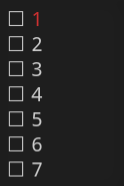

Experimental, C++20 GUI library for small displays with 3 button input. Developed with microcontrollers in mind. 




* [Character based](https://en.wikipedia.org/wiki/Box-drawing_character), platform independent, [immediate mode](https://en.wikipedia.org/wiki/Immediate_mode_(computer_graphics)). Works as long as a character can be printed in x,y coordinates (for instance in [ncurses](https://tldp.org/HOWTO/NCURSES-Programming-HOWTO/index.html), [Zephyr RTOS cfb](https://docs.zephyrproject.org/latest/reference/display/index.html), etc).
* Cursor (x,y).
* Many screens at once. **????** **???????!!!!!!**
* Input handling hooks for easy integration.
* C++20, no dependencies.
* No dynamic allocation (apart of std::string used only for optional debug).
* (Almost) single header.

# Hooks
* print at cursor's possition with clipping (clips to the viewport area even if passed coordinates are **negative**).
* switch color (2 colors)
* move cursor

## Zephyr CFB
Example can be found in `test/integration/zephyr/src/main.cc`. The display has to be already properly initized as the oledgui only draws and clears the screen.

# FAQ
* How to add a margin? No automatic margins, just add a space.

# Tutorial
aaa

# TODO
* [x] vbox (hbox, hbox) works OK, but hbox (vbox, vbox) does not (at least not when the nesting structure is complicated).
* [x] screen wide/tall
* [x] current focus
* [ ] text wrapping widget (without scrolling up - only for showinng bigger chunkgs of text, like logs)
* [x] scrolling container - as the above, but has a buffer (license, help message).
* [x] checkboxes
* [x] radiobutons (no state)
* [x] radiobutton group (still no state, but somehow manages the radios. Maybe integer?)
* [ ] menu / list (possibly implemented using vbox and radio-s without radio icon (as an option))
  * [ ] Demo - menu 
  * [x] Navigation between screens - research how to do it the best from the API perspective.
  * [ ] Show how to make a table-like layout (preferably with dynamic content - like 2 colums of temperature readings with labels etc.).
* [x] combo - "action" key changes the value (works for numbers as well)
  * [ ] icon aka indicator aka animation (icon with states) - this can be implemented using the combo (with an option).
* [x] Button (with callback).
* [x] std::string - like strings
  * [ ] Test with std::string_view, std::string and etl::string. Test with std::refs
  * [ ] compile-time strings as an option. Strings which would be *structural* (????? dunno if worth the effort).
  * [ ] ~~Add explicit width as a template parameter everywhere where utf8 steings can be passed. Then use this width instead of label_.size () if available~~ EDIT : wrap in hbox as a workaround.
* [ ] Stabilize the API
  * [x] Resolve TODOs in radio and group (about this ID template argument)
    * [x] Radio class has an argument called ID but it is not used! It's ignored in favor of automatically assigned one (starting from 0). There's a branch which removes this arg, but I don't regard this approach as good. Try to fix the ID arg.
  * [x] Make radioGroup and combo APIS simmilar.
  * [x] callbacks and / or references - for all widgets that have input. 
  * [x] Combo box accepts only `const char *` instead of templatized `c::string` concept.
  * [ ] Styling (external template class impacting various aspects of the output)
  * [ ] AND / OR Widget parameters dictating the looks.
  * [ ] (duplicate) Test the api for potetntial user mistakes. Aren't compiler error messages too long? If yes, fix so they are shorter (concepts as soon ass possible).
* [x] bug: empty line after nested container 
* [x] A window. Like ncurses window (i.e. area). It has to have its own coordinate system and focusCounter. It should overlay what was previously displayed (easy and concise)
  * [x] Dialog
* [x] Console backend (with or even without input)
* [x] Implement a test widget which is more than 1 character tall.
  * [x] Test this widget in the vertical and horizontal layouts.
    * [x] Widgets having height > 1 have to implement their own scrolling. I haven't anticipated that a widget can be half visible.
* [x] vbox(); (no parameters) results in an error.
* [x] Write concepts for widgtes, layouts, widgteTuples, groups etc and use them instead of raw typename.
* [x] Describe how the code works in a comment on the top.
* [x] Make the functions std::ref aware
* [x] Separate directory for tests, and static_assert tests.
* [x] Composite widgets as a possibility (or implement the text widget with scroll buttons).
  * [ ] Do the same with factory method that returns such a composite...
* [x] hbox (vbox (), vbox()) was not ever tested. But it won't work anyway, because widgets have ho width. I could add tmpl. param `width` to the container widgets however.
* [x] vspace
* [ ] Prepare backends for:
  * [x] Zephyr
  * [x] Ncurses
  * [ ] Arduino
* [ ] Colors are (at least for now) represented as simple integers. Color 1 == normal, Color 2 == highlighted / special. Rename color to Style, make 2 styles : regular, highlighted
* [ ] Prepare for compile time optimization
  * [ ] Cmake target which tests the size with a tool. Like size or bloaty. Saves a list with statistics + commit hash. Maybe a commit hook?
    * [ ] Debug, release and -OS targets
  * [ ] Benchmark compilation size.
  * [ ] Benchmark cpu?
* [x] Have short think if, and remove the child field (and API) from Display* classes.
  * [x] Then research an idea if Display can inherit from an interface making Display hierarchy (dynamically) polymorpic.
    * [ ] Then check if og::detail::augment::Window and og::Suite can inherit common interface (which in turn would take this IDisplay from above as an arg.). This way I would make possible to hide different windows in different translation units. Only a function retutning reference to an interface 
* [ ] Implement something more than a dummy examples, and test the API in real life. 
  * [ ] How to set the initial value other than assiging a widget to a variable and then using variable's methods?
* [ ] Try to break the API. Is there a way to pass something that the concepts accept, but then it causes an error somewhere deeper? For instance combo ID has to be std::copyable is that enough?
* [ ] Bug: one can't put a widget (combo in my case) directly into window. It has to be wrapped in a hbox/vbox. 
* [ ] Prepare composite widget for integers
* [ ] Prepare composite widget for floats


# Documentation TODO:
* When you implemnt a custom widget, by default it is not focusable. Inherit from og::Focusable to change it.
* ~~Display has its own context, so you don;t have to use a window???~~ It was removed.
* Some (text() ?)functions behave like the std::make_pair does in a way that they strip out the reference wrappers.
* Only '\n's are recognized as newline characters by text widget.
* No window in a window should be possible. Just display two, one after another.
* Glossary : 
  * container widget : layout, group & window. 
  * composite widget : widgets returned by special factory methods which was designed to compose few other widgets in a container (for instance a text widget with buttons to scroll the contents up and down.)
* Show how to write a composite widget (text widget as an example)

Layouts:
* Assumption : every widget starts to draw itself where the cursor currently is right now, and leaves the cursor in it's bottom right corner. So for example if the current cursor coordinates are (2, 2) and we draw a `text` widget which is 3 chars wide and 3 chars tall, the resulting position of the cursor should be (5, 5). Every widget has to comply with this, otherwise layouts won't work as expected.
  * Thus widgets are responsible for moving the cursor accordingly after drawing themselves.
* Layer 1 requires height field, but width is optional. If no width is present in a widget, 0 is assumed
* Show (on a diagram) where the cursor ends up after drawing various configurations of layouts and widgets
* All widgets have their heights defined (either as a variable or calculated) and available at compile time. Width at the other hand, is trickier, as widgets don't have to provide it at compile time. For example it would be impossible for a label to know its with based on its run-time contents.
  * As a result it is easy (easy as C++ meta-programing goes) to calculate layout's height (you sum all the contained widgets' heights) but not that easy to do the same with width. This is why you can explicitly specify the width of a layout. However it sums the contained children' widths but then gets the max of the sum and explicit value.

* `c::string` concept.
  * copyable
  * has size () -> std::size_t
  * tip : you can use std::ref
* c::text_buffer : c::string + cbegin & cend
  * tip : you can use std::ref

* utf8 strings can confuse the length calculation (no UTF8 library is used here, and in general utf8 is not supported). If this is a case, use layout: hbox<1> (label ("▲"))
* Button input implementation. To consider:
  * PC style keyboard : an event is generated on key-press, and consecutive events are automatically generated when a button is held down.
  * Cellphone keyboard : an event is generated on key-up. When a buttion is held down for prolonged period of time, different type of event is generated (so called long-press). 
  * Apart of the above two we can detect multiple keystrokes at once or only single one.
  * Apart of everything else we can do it in an ISR or by polling (the latter seems to have more sense when there's many buttons, but energy efficiency has to be considered as well). [See this library](https://github.com/thomasfredericks/Bounce2)
* Minimum widget API is defined by `c::widget` concept but what about full feature set of this API? I have to document that:

```cpp
struct Custom : public Focusable /* or use `static constexpr bool canFocus = true;` */ {
        static constexpr Dimension height = 1;
        static constexpr Dimension width = 1;

        template <typename Wrapper> Visibility operator() (IDisplay &disp, Context const &ctx) const { return Visibility::visible; }

        template <typename Wrapper> void input (IDisplay &disp, Context const &ctx, Key key);
        // template <typename Wrapper, typename Callback> void input (IDisplay &disp, Context const &ctx, Key key, Callback &clb, ValueT &value);
};
```


# A short code description
There are two layers of class templates.

## Layer 1 (namespace og::)
User creates a static tree of widgets where dimensions and positions of these widgets are
fixed (compile time). Then, thanks to the static nature of the implementation certain attributes
can be calculated at compile time:
* height at which a widget is located looking from the top of the screen
* focusIndex

### Widgets
There are two layers of class templates here (I'll refer to them as simply classes for short).
First there are classes like Check, Radio and so on, and they are created by corresponding
factory methods named accordingly (check, radio etc). Widgets can have these fields:

* Coordinate height: height in characters.
* bool canFocus: tells if widget can have focus. You also may inherit from Focusable class.
* template <typename Wrapper> Visibility operator() (auto &d, Context const &ctx) const : draws
        the widget on the screen.
* template <typename Wrapper> void input (auto &display, Context const &ctx, char c) : handles
        the input

The first layer is meant to be extended by the user.

### ContainerWidgets
Then there are ContainerWidgets : Layout, Group and Window. When filled with children, they
are able to calculate uint16_t focusableWidgetCount at compile time. This variable tells how many
child widgets inside a container is able to accept focus. Other than children (or child) fields
there is nothing special about them. Both Layouts, Groups and Windows inherit from ContainerWidget
class (static polymorphism aka CRTP).

### Layouts
Although layout is a type of a widget, it can store arbitrary number of other widgets.

### (Radio) Groups
Stores one or more instances of Radio class.

### Windows
Can contain only 1 child. maintains a Context which stores runtime informations as current
cursor position (or a pointer to it).

## Layer 2 (namespace og::augment::)
This layer is not meant to be extended or inherited from by the user. It contains class templates
that wrap widgets and adds more information at compile time. This information includes:
* Dimension getHeight (): for container widgets this is a sum of all children heights.
        getHeight () - uses information from layer 1 solely. It can be calculated in the layer 1
        classes. This is because simple widgets (i.e. not containers) know their height from the very
        start (usually 1). And containers can simply sum all the heights of their children which is
        simple to do at compile time.
* Selection getRadioIndex (): this returns a child number in a container starting from 0. This
        leverages information from the layer 1 and is calculated in between the layers in the
        Wrapper helper classes. Wrapper helpers implement more involving compile time iterations
        over children. Due to the fact that every container starts incrementing the radio index
        from the 0, this value is also easy to obtain in a simple compile time "loop". See
        transformImpl and transform functions.
* Focus getFocusIndex (): every focusable widget in the tree has consecutive number assigned,
        and this method returns that number. This is calculated in a similar way as the previous
        one, but this time add int 1 every time is not enough as the whole tree has to be traversed.
        What is more, the tree is not heterogeneous, because you can have a mix of Layouts, Groups
        and Windows (although not every combination makes sense and may be prohibited in the future
        by some static checks or concepts). Thus the getFocusableWidgetCount helper function returns
        the appropriate value for every child. If it's a simple widget, it returns a simple value,
        otherwise it sums the heights recursively.
* getY (): this method returns the position in characters of a widget starting from the top
        of the screen. What differentiates this field is that it uses information from both
        layers : height fields from layer 1 and getHeight() from layer 2 (og::augment::). The
        getHeightIncrement helper is used in the transformImpl to achieve that.

### Problem with Groups
The problem with this container is that goes between the Layout and the Radio instances. It implements
only grouping, while the positioning of the radios resulting from the concrete Layout type (hbox or vbox)
has to be maintained. This is troublesome in compile time environment, so the introspection ios used in
some places to differentiate between Layouts and Groups (by introspection i mean if `constexpr` (requires {
check for a method or field })). Also the GrandParent parameter was added solely for the purpose of
implementing Groups. See the getHeightIncrement.

### Problem with Windows
Not so difficult to solve as previous one, but still. The runtime information (as opposed to compile
time stuff like positions, orderings and heights) has to be accessible for every widget in a tree.
For this reason the Context class was introduced. A display instance has its own context (this may
be subject to change) and then the Windows also have their own Context-s. This is because a window
can be drawn on top of another, and we have to maintain the runtime state of both. The way this is
implemented is that if a concrete ContainerWidget instance has its own context field it replaces the
previous (parent's or display's). The changeContext is used fo that.